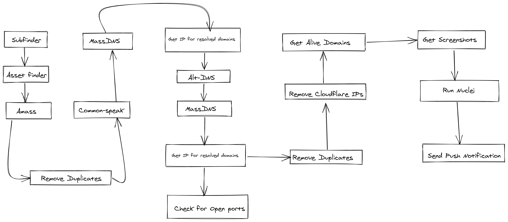

# RECONNER
```


██████╗ ███████╗ ██████╗ ██████╗ ███╗   ██╗███╗   ██╗███████╗██████╗
██╔══██╗██╔════╝██╔════╝██╔═══██╗████╗  ██║████╗  ██║██╔════╝██╔══██╗
██████╔╝█████╗  ██║     ██║   ██║██╔██╗ ██║██╔██╗ ██║█████╗  ██████╔╝
██╔══██╗██╔══╝  ██║     ██║   ██║██║╚██╗██║██║╚██╗██║██╔══╝  ██╔══██╗
██║  ██║███████╗╚██████╗╚██████╔╝██║ ╚████║██║ ╚████║███████╗██║  ██║
╚═╝  ╚═╝╚══════╝ ╚═════╝ ╚═════╝ ╚═╝  ╚═══╝╚═╝  ╚═══╝╚══════╝╚═╝  ╚═╝


```

<br>

<!-- TABLE OF CONTENTS -->
<details open="open">
  <summary>Table of Contents</summary>
  <ol>
    <li>
      <a href="#description">Description</a>
    </li>
    <li>
      <a href="#getting-started">Getting Started</a>
      <ul>
        <li><a href="#prerequisites">Prerequisites</a></li>
        <li><a href="#installation">Installation</a></li>
      </ul>
    </li>
    <li><a href="#usage">Usage</a></li>
    <li><a href="#roadmap">Roadmap</a></li>
    <li><a href="#contributing">Contributing</a></li>
    <li><a href="#author">Author</a></li>
    <li><a href="#acknowledgements">Acknowledgements</a></li>
	<li><a href="#copyright-and-license">Copyright and License</a></li>
  </ol>
</details>


## Description
Reconner is a script for automating the [Reconnaissance](https://www.redteam-pentesting.de/en/pentest/reconnaissance/-penetration-test-reconnaissance-information-gathering-before-the-attack) process which is the initial phase of a pentesting activity.

It automates various tasks like:

* Gathering subdomains
* Resolving subdomains at a high rate
* Checking for open ports
* Gather IPs of the assets
* Gather alive sub-domains
* Take screenshots of the alive sub-domains





## Getting Started

## Prerequisites
Go **go1.14+** is required, `$GOPATH`, `$GOROOT` should be set and `$GOPATH/bin` in your `$PATH`

<br>

## Installation
The installation script installs/downloads all the required tools to a directory `/root/sec`.


1. `export SEC=/root/sec`
2. To install, run `sudo bash install.sh`
3. Put **amass_config.ini** with your **API keys** in `/root/sec/`

<br>

## Usage
1. Clone the repo
2. `bash reconner.sh -d example.com`

<br>

## Roadmap
- Add subdomain takeover by subjack
- Add CORS misconfiguration scanner [Optional]
- Add Vhost discovery

<br>

## Contributing

Contributions are what make the open source community such an amazing place to be learn, inspire, and create. Any contributions you make are **greatly appreciated**.

1. Fork the Project
2. Create your Feature Branch (`git checkout -b feature/AmazingFeature`)
3. Commit your Changes (`git commit -m 'Add some AmazingFeature'`)
4. Push to the Branch (`git push origin feature/AmazingFeature`)
5. Open a Pull Request

<br>

## Output
The script will output the data in `/root/sec/subdomains/example.com/`

<br>

## Author

Sushant Soni - [@sushantsoni5392](https://twitter.com/sushantsoni5392)

<br>

## Acknowledgements

* [OWASP Amass](https://github.com/OWASP/Amass)
* [Commonspeak wordlist](https://github.com/assetnote/commonspeak2-wordlists)
* [Massdns](https://github.com/blechschmidt/massdns)
* [Aquatone](https://github.com/michenriksen/aquatone)
* [Seclists](https://github.com/danielmiessler/SecLists)
* [Masscan](https://github.com/robertdavidgraham/masscan)
* [Altdns](https://github.com/infosec-au/altdns)
* [Httprobe](https://github.com/tomnomnom/httprobe)
* [Meg](https://github.com/tomnomnom/meg)
* [Readme Template](https://github.com/othneildrew/Best-README-Template)

<br>

## Copyright and License

> The MIT License (MIT)
>
> Copyright (c) 2021 Wingify Software Pvt. Ltd.
>
> Permission is hereby granted, free of charge, to any person obtaining a copy of this software and associated documentation files (the "Software"), to deal in the Software without restriction, including without limitation the rights to use, copy, modify, merge, publish, distribute, sublicense, and/or sell copies of the Software, and to permit persons to whom the Software is furnished to do so, subject to the following conditions:
>
> The above copyright notice and this permission notice shall be included in all copies or substantial portions of the Software.
>
> THE SOFTWARE IS PROVIDED "AS IS", WITHOUT WARRANTY OF ANY KIND, EXPRESS OR IMPLIED, INCLUDING BUT NOT LIMITED TO THE WARRANTIES OF MERCHANTABILITY, FITNESS FOR A PARTICULAR PURPOSE AND NONINFRINGEMENT. IN NO EVENT SHALL THE AUTHORS OR COPYRIGHT HOLDERS BE LIABLE FOR ANY CLAIM, DAMAGES OR OTHER LIABILITY, WHETHER IN AN ACTION OF CONTRACT, TORT OR OTHERWISE, ARISING FROM, OUT OF OR IN CONNECTION WITH THE SOFTWARE OR THE USE OR OTHER DEALINGS IN THE SOFTWARE.
